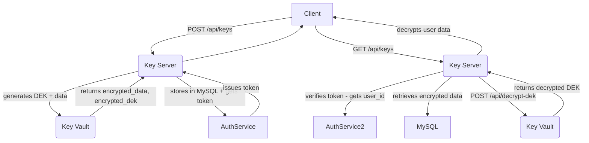

# Key Management System (KMS) with JWT Auth

## Overview

This project is a microservice-based **Key Management System** (KMS) with secure handling of Data Encryption Keys (DEKs), Master Keys (MKs), and JWT-based authentication.

### Components

1. **Auth Service (`auth/`)**

   * Issues and verifies JWT tokens.

2. **Key Server (`key-server/`)**

   * Handles DEK encryption and user key storage.
   * Interacts with the Key Vault Server and Auth service.

3. **Key Vault Server (`master-key-server/`)**

   * Performs encryption/decryption of DEKs using master keys.
   * Stores master keys securely in MySQL.

---

## Setup

### Prerequisites

* Node.js v16+
* MySQL 8.x

### Environment Variables

Set `ROOT_KEY` for the master key encryption in master-key-server:

```bash
export ROOT_KEY="your-secure-root-key-32bytes"
```

### MySQL DB

Create a database named `kms` in key-server:

```sql
CREATE DATABASE kms;
```

---

## Auth Service (Port: `8002`)

### Endpoints

* `POST /issue`

  * Issues a JWT with custom payload.
  * **Request:** `{ id: <user_id> }`
  * **Response:** `{ token: <jwt_token> }`

* `POST /verify`

  * Verifies a JWT and returns the payload.
  * **Request:** `{ token: <jwt_token> }`
  * **Response:** `{ valid: true, payload: { id : <user_id> } }`

---

## Key Server (Port: `8000`)

### Endpoints

#### 1. `POST /api/keys`

* Encrypts and stores a user's key.
* **Input:**

```json
{
  "data": "<sensitive_data_like_card_number>",
  "user_id": "<user_id>"
}
```

* **Flow:**

  1. Generates a 32-byte DEK.
  2. Sends data + DEK to Key Vault Server for encryption.
  3. Stores encrypted key + encrypted DEK in DB (`kms_keys`).
  4. Requests an access token from Auth service. ( for demo )
  5. Returns JWT token. ( for demo )

* **Response:**

```json
{
  "message": "Key stored successfully",
  "access_token": "<jwt_token>" // for demo
}
```

#### 2. `GET /api/keys`

* Retrieves and decrypts the user’s key.

* **Headers:** `Authorization: Bearer <jwt_token>`

* **Flow:**

  1. Verifies JWT token.
  2. Fetches encrypted data from `kms_keys` by `user_id`.
  3. Sends encrypted DEK to Key Vault Server for decryption.
  4. Decrypts encrypted key using DEK.
  5. Returns original plaintext data.

* **Response:**

```json
{
  "data": "<original_plaintext_data>"
}
```

#### 3. `GET /api/rotate-mk`

* Placeholder for triggering master key rotation.
* Not for Production
---

## Key Vault Server (Port: `8001`)

### Endpoints

#### 1. `POST /api/encrypt`

* Encrypts plaintext using DEK and DEK using Master Key.
* **Input:**

```json
{
  "data": "<base64-encoded-plaintext>",
  "dek": "<hex-dek>"
}
```

* **Returns:**

```json
{
  "encrypted_key": "<base64>",
  "encrypted_dek": "<base64>"
}
```

#### 2. `POST /api/decrypt-dek`

* Decrypts an encrypted DEK using the master key.
* **Headers:** `Authorization: Bearer <jwt_token>`
* **Input:**

```json
{
  "encrypted_dek": "<base64>"
}
```

* **Response:**

```json
{
  "dek": "<hex-dek>"
}
```

---

## Master Key Management

### File: `master_key_manager.js`

Handles lifecycle of Master Keys:

* `addMasterKey(keyId, hexKey)`

  * Encrypts and stores a new MK.
  * Marks all others as retired.

* `getActiveMasterKey()`

  * Returns the latest active master key (decrypted).

* `getRetiredMasterKeys()`

  * Returns list of previously used MKs.

* `listMasterKeys()`

  * Lists all keys with status and timestamps.

---

## Database Schema

### Table: `master_keys`

```sql
CREATE TABLE master_keys (
    id INT AUTO_INCREMENT PRIMARY KEY,
    key_id VARCHAR(64) UNIQUE NOT NULL,
    key_material TEXT NOT NULL,
    created_at DATETIME NOT NULL,
    status ENUM('active', 'retired') NOT NULL,
    description TEXT
);
```

### Table: `kms_keys`

```sql
CREATE TABLE kms_keys (
    user_id VARCHAR(64) PRIMARY KEY,
    encrypted_key TEXT,
    encrypted_dek TEXT,
    created_at DATETIME
);
```

---

## Technical Flow



---

## Security Notes

* All encryption uses AES-256-CBC with PKCS#7 padding.
* JWTs are signed using a shared secret.
* Master keys are encrypted using a hashed root key.
* Access to endpoints requiring sensitive operations is protected by JWT auth.

---

## Author
Mahaveer

## License

Apache2
